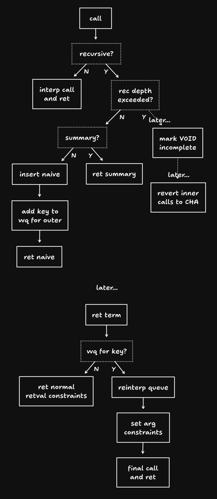

# recursion

## context

* given function `f(&dyn A, &dyn B) -> &dyn C` can give different/more specific output constraints based on the constraints on `a` and `b`
* thus, treat these as different variants of `f`
    * e.g. `f` called where "`a` can only be `Cat` or `Bird`" and "`b` can only be `Food`" which ends up giving "`C` can only be `Fish`"
* have a summary table which stores these mappings, corresponding argument constraints with return constraints

## flow

## code

* `struct ArgSet`: ordered list (argument order) of unordered constraints (stored in a set), used for keying a certain call to a function with certain constraints
* `type SummaryKey`: stores a `VOID` to identify a certain function and an `ArgSet` for the certain constrained function variant
* `InterpPass` additions
    * `summaries`: summary table
    * `in_queue`: whether a variant is being processed higher in the recursion stack
    * `key_stack`: call stack but for `SummaryKey`s
    * `wq`: reinterps needed to be done by a variant
    * `rec_depth`: reinterp depth, for depth limit
    * `dependencies`: calls corresponded to their potential call stacks
    * `incomplete`: reinterped variants that were not fully completed
* `fn reinterp_recursion`: main function that is called when going through the `wq`, which processes internal calls again
    * after all of these calls are done, the top function is finally reinterpreted within `interp_return`
